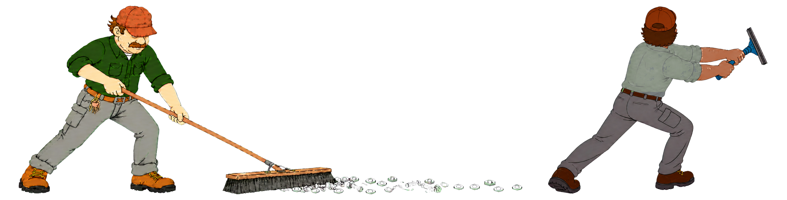

# Scruffy's Mop



> **Scruffy's Mop** is the fix/redesign executor for [Scruffy](../scruffy). Scruffy finds the AI slop and proves it. Scruffy's Mop cleans it up — to a real craft bar — and hands it back for re-audit.

## The loop

```
Scruffy AUDIT ─► findings + context + decisions (+ tokens)
                        │  approved items only
                        ▼
        Scruffy's Mop PROPOSES directions.json        (design lanes:
                        │  3 distinct options/group,   visual · product ·
                        │  one recommended, human      IA · interaction)
                        │  SELECTS in the dashboard
                        ▼
              Scruffy's Mop IMPLEMENTS (redesign/design authority;
                        │   impeccable when present, craft floor always)
                        ▼
Scruffy RE-AUDIT ─► items move open → fixed / cleared on real evidence
```

Non-design lanes (copy, backend shape, performance) skip the picker and are
implemented directly from the approved item's recommendation. `recommended`
is advice — nothing is built that a human didn't pick.

**The visual contract.** A UI recommendation cannot be made with text alone.
Every direction cites the principle(s) that motivated the finding
(`principle_refs` into Scruffy's corpus: Kole Jain `[KJ §n]`, `[RUI]`,
`[Butterick]`, `[NN/g #n]`, `PRINCIPLES §n`), and a visual-category direction is
**not selectable without an image anchor** — a template/reference image
(Mobbin export, taste-library entry, `--templates <dir>`) or an annotated
baseline screenshot from the audit's evidence. No imagery in the runtime →
the group renders `imagery: unavailable`, stays advisory, and the check
refuses any selection. Text-only design advice fails closed instead of
shipping.

**Provenance is part of the contract.** Every image anchor declares an
`origin` — `target_baseline` (this audit's own screenshots), `design_reference`
(a named external pattern source), `taste_library` (your curated reuse dir), or
`mockup` — and must live inside a declared reference source or this bundle.
Imagery from another product's audit or lab is refused as cross-product
leakage: one engagement's evidence never grounds another's directions. The
scaffold offers taste-library images as a per-group `reference_pool` and never
auto-attaches them; assigning an image to a direction is a deliberate act.

**Scruffy diagnoses and clears; Scruffy's Mop only implements.** Scruffy's Mop never produces
findings, never scores authorship, and never marks its own work fixed.

**Visual redesign is the headline job.** For `visual`/`product` findings the Mop
grounds a direction in real shipped products (a design-reference search such as
Mobbin — paid, optional) and drives the change through the **impeccable** craft
engine (free, first-class when the runtime has it). A built-in craft floor always
applies, so it still runs fully with neither augmentation present — the free-tier
path. What was available is disclosed in the handoff; an absence is never a defect.

## Interoperability

Scruffy owns the audit contract. Scruffy's Mop consumes it **read-only** and declares a
consumer compatibility key in [`schema/interop.json`](schema/interop.json):

| Artifact | Schema | Used for |
|---|---|---|
| `findings.json` | registry 2.1 | what to fix + `acceptance_checks` |
| `context.json` | 1.1 | dependency-ordered `work_orders` + product truth |
| `decisions.json` | 2.1 | the `approve` gate |
| `tokens.json` | 1.0 (optional) | observed-value token corrections |

The full handoff is documented in
[`references/scruffy-handoff.md`](references/scruffy-handoff.md).

## Usage

Every session starts with the orchestrator — one command, always the same shape:

```sh
python3 scripts/mop_run.py <bundle-dir> [--templates <taste-library-dir>] [--assets assets.json] [--authorized]
```

That always produces, in order: `mop-preflight.json` (capabilities probed, never
assumed — including Playwright browsers), a validated or freshly scaffolded
`directions.json` (three structurally distinct, principle-cited directions per
design group; a visual direction is not selectable without an image anchor, and
imagery outside declared reference sources is refused as cross-product leakage),
and `mop-dashboard.html` — the decision surface, with the duo brand banner, a
Provenance tab on every finding (Source → Rule → Detector pack → Signal →
Evidence), explicit slop-category labels, and per-item screenshots or an
explicit disclosure that none were captured.

The underlying tools remain available piecemeal (`mop_bundle.py check|plan`,
`mop_preflight.py`, `mop_directions.py scaffold|check`, `mop_dashboard.py`,
`mop_handoff.py --augmentations @file`), per
[`references/fix-protocols.md`](references/fix-protocols.md).

The visual-redesign deliverable is a **single self-contained HTML dashboard** —
every screenshot and reference embedded as a `data:` URI, no external loads —
because the operator reads output in a terminal. Capabilities come from a real
**probe** (`mop_preflight.py`): a capability is `absent` only after a probe fails.

Inside Claude Code, run `/scruffys-mop:scruffys-mop` and give it the bundle. A
worked example bundle ships at [`fixtures/sample-audit/`](fixtures/sample-audit/).

## Status

Functional and field-run. The runtime method, interop contract, deterministic
scripts, fixture bundle, and a 41-case test suite are green
(`python3 scripts/test_mop.py`, `python3 scripts/validate_skill.py`). First
real-world loop completed 2026-08-14 against the NagOps audit: approved
recovery-copy findings implemented under explicit user grant, handed off, and
re-verified by a Scruffy revision-2 audit (one item fixed on evidence, one
honestly carried for its remaining CI gate). Fixture findings are titled
`[FIXTURE]` and self-label as fake so demo data can never read as a real
product.

## License

MIT © 2026 Zach Satterly
